# 🎓 Teacher Management System (TMS)

[](https://nextjs.org/)
[](https://reactjs.org/)
[](https://www.typescriptlang.org/)
[](https://tailwindcss.com/)
[](https://clerk.com/)

---

## 🌟 Project Overview

The **Teacher Management System (TMS)** is a comprehensive web application designed to streamline educational administration with modern technologies and professional design. Built with React 19, Next.js 15, and TypeScript, it provides a centralized platform for managing teachers, students, meetings, and administrative workflows.

### 🎯 Key Highlights

- **Modern Tech Stack**: React 19, Next.js 15, TypeScript 5
- **Enterprise Authentication**: Clerk integration with custom branding
- **Real-time Analytics**: Live data updates and interactive charts
- **Professional Design**: Classic aesthetic with burgundy and dark blue theme
- **Mobile-First**: Responsive design optimized for all devices
- **Production Ready**: Scalable architecture with best practices

---

## 📊 Visual Architecture Diagram

```mermaid
graph TB
    %% User Layer
    subgraph "👥 USER LAYER"
        U1[👨‍🏫 Teachers]
        U2[👩‍💼 HR Staff]
        U3[👨‍💻 Administrators]
        U4[👩‍🎓 Students]
    end

    %% Presentation Layer
    subgraph "🖥️ PRESENTATION LAYER"
        subgraph "🔐 Authentication"
            P1[Sign In Page]
            P2[Sign Up Page]
            P3[Clerk Auth]
        end
        
        subgraph "📊 Dashboard"
            P4[Analytics Dashboard]
            P5[Reports & Charts]
            P6[Calendar View]
        end
        
        subgraph "🧩 Components"
            P7[Sidebar Navigation]
            P8[Header Component]
            P9[Modal System]
        end
    end

    %% Business Logic Layer
    subgraph "⚙️ BUSINESS LOGIC LAYER"
        subgraph "📋 DataContext (State Management)"
            B1[👨‍🏫 Teacher Management]
            B2[👥 Student Management]
            B3[🤝 Meeting Management]
            B4[🏖️ Leave Management]
            B5[📈 Analytics Engine]
            B6[🔄 Real-time Updates]
        end
    end

    %% Data Layer
    subgraph "💾 DATA LAYER"
        D1[📂 allMockData.js]
        D2[👨‍🏫 Teachers Data]
        D3[👩‍🎓 Students Data]
        D4[📅 Meetings Data]
        D5[📝 Leave Requests]
        D6[📊 Analytics Data]
    end

    %% External Services
    subgraph "🌐 EXTERNAL SERVICES"
        E1[🔐 Clerk Authentication]
        E2[🎨 Lucide React Icons]
        E3[🎯 Tailwind CSS]
    end

    %% Connections
    U1 --> P1
    U2 --> P4
    U3 --> P5
    U4 --> P6
    
    P1 --> B1
    P4 --> B5
    P7 --> B6
    
    B1 --> D2
    B2 --> D3
    B3 --> D4
    B4 --> D5
    B5 --> D6
    
    P3 --> E1
    P7 --> E2
    P4 --> E3

    %% Styling
    classDef userLayer fill:#E3F2FD,stroke:#1976D2,stroke-width:2px
    classDef presentationLayer fill:#E8F5E8,stroke:#388E3C,stroke-width:2px
    classDef businessLayer fill:#FFF3E0,stroke:#F57C00,stroke-width:2px
    classDef dataLayer fill:#F3E5F5,stroke:#7B1FA2,stroke-width:2px
    classDef externalLayer fill:#F5F5F5,stroke:#616161,stroke-width:2px

    class U1,U2,U3,U4 userLayer
    class P1,P2,P3,P4,P5,P6,P7,P8,P9 presentationLayer
    class B1,B2,B3,B4,B5,B6 businessLayer
    class D1,D2,D3,D4,D5,D6 dataLayer
    class E1,E2,E3 externalLayer
```



---

## ✨ Core Features

### 🔐 **Secure Authentication System**
- **Enterprise-grade Security**: Powered by Clerk authentication
- **Custom Branded Pages**: Professional sign-in/sign-up experience
- **Route Protection**: Middleware-based security
- **Session Management**: Secure user sessions with automatic refresh

### 👨‍🏫 **Teacher Management**
- **Complete CRUD Operations**: Add, edit, delete, and view teacher profiles
- **Advanced Search & Filter**: Find teachers by name, subject, or department
- **Real-time Updates**: Instant synchronization across all components
- **Bulk Operations**: Efficient management of multiple records

### 📊 **Analytics Dashboard**
- **Performance Metrics**: Visual charts and comprehensive statistics
- **Subject Distribution**: Interactive pie charts and analytics
- **Calendar Integration**: Schedule overview and planning tools
- **Real-time Data**: Live updates across all metrics and reports

### 🤝 **Meeting Management**
- **Flexible Scheduling**: HR meetings, senior staff meetings, and custom types
- **Status Tracking**: Pending, confirmed, completed, and cancelled states
- **Advanced Filtering**: Filter by date, type, status, and participants
- **Calendar Integration**: Visual meeting overview and conflict detection

### 🏖️ **Leave Management**
- **Request Workflow**: Submit, track, and manage leave requests
- **Approval System**: HR approval/rejection with comments
- **Leave History**: Complete tracking and audit trail
- **Balance Management**: Leave quota tracking and analytics

### 👥 **Student Management**
- **Comprehensive Profiles**: Detailed student information and records
- **Grade Analytics**: Performance visualization and tracking
- **Interactive Charts**: Pie charts for grade distribution
- **Progress Monitoring**: Academic performance insights

---

## 🛠️ Technology Stack

### **Frontend Framework**
```
⚛️ React 19              📦 Next.js 15           📘 TypeScript 5
• Modern Hooks           • App Router            • Type Safety
• Context API            • Server Components     • Better DX
• Functional Components  • Optimization          • Runtime Safety
```

### **Styling & UI**
```
🎨 Tailwind CSS 4       🎯 Lucide React        🎪 Custom Design System
• Utility-first         • Modern Icons          • Burgundy Theme
• Responsive Design     • Consistent UI         • Dark Blue Accents
• Performance           • Accessibility         • Professional Look
```

### **State Management**
```
🔄 React Context        🎣 Custom Hooks        📋 Centralized Data
• Global State          • Reusable Logic       • Real-time Updates
• Provider Pattern      • Clean Architecture   • Automatic Sync
• Performance           • Maintainability      • Type Safety
```

### **Authentication & Security**
```
🔐 Clerk Authentication 🛡️ Middleware         🎫 JWT Tokens
• Enterprise Grade      • Route Protection     • Secure Sessions
• Social Login          • Server-side Auth     • Token Management
• User Management       • Error Handling       • Security Headers
```

---

## 🚀 Quick Start

### **Prerequisites**
- Node.js 18+
- npm or yarn
- Git

### **Installation Steps**

1. **Clone the repository**
   ```bash
   git clone https://github.com/komal0821/teacher-management-system.git
   cd teacher-management-system
   ```

2. **Install dependencies**
   ```bash
   npm install
   # or
   yarn install
   ```

3. **Set up environment variables**
   ```bash
   cp env.example .env.local
   ```
   
   Add your Clerk authentication keys:
   ```env
   NEXT_PUBLIC_CLERK_PUBLISHABLE_KEY=your_clerk_publishable_key
   CLERK_SECRET_KEY=your_clerk_secret_key
   NEXT_PUBLIC_CLERK_SIGN_IN_URL=/sign-in
   NEXT_PUBLIC_CLERK_SIGN_UP_URL=/sign-up
   NEXT_PUBLIC_CLERK_AFTER_SIGN_IN_URL=/
   NEXT_PUBLIC_CLERK_AFTER_SIGN_UP_URL=/
   ```

4. **Run the development server**
   ```bash
   npm run dev
   # or
   yarn dev
   ```

5. **Open your browser**
   
   Navigate to [http://localhost:3000](http://localhost:3000)

---

## 📁 Project Structure

```
teacher-management-system/
├── 📱 src/
│   ├── app/                    # Next.js App Router
│   │   ├── page.tsx           # Main dashboard
│   │   ├── sign-in/           # Authentication pages
│   │   ├── sign-up/
│   │   └── layout.tsx         # Root layout with providers
│   │
│   ├── components/            # React Components (33+)
│   │   ├── Dashboard.tsx      # Main dashboard
│   │   ├── ManageTeachers.tsx # Teacher CRUD operations
│   │   ├── DashboardReports.tsx # Analytics & reports
│   │   ├── TeacherMeetings.tsx # Meeting management
│   │   ├── TeacherLeaves.tsx  # Leave management
│   │   ├── StudentsEnhanced.tsx # Student management
│   │   └── Sidebar.tsx        # Navigation sidebar
│   │
│   ├── contexts/              # State Management
│   │   └── DataContext.tsx    # Centralized data context
│   │
│   ├── data/                  # Mock Data
│   │   └── allMockData.js     # Application data
│   │
│   ├── types/                 # TypeScript Definitions
│   │   └── teacher.ts         # Type definitions
│   │
│   └── middleware.ts          # Authentication middleware
│
├── 📄 Documentation/
│   ├── ARCHITECTURE.md        # System architecture
│   ├── LOOM_VIDEO_SCRIPT.md   # Demo video script
│   └── PROJECT_OVERVIEW.md    # Complete project overview
│
├── ⚙️ Configuration/
│   ├── package.json           # Dependencies & scripts
│   ├── tailwind.config.js     # Styling configuration
│   ├── next.config.js         # Next.js configuration
│   └── tsconfig.json          # TypeScript configuration
│
└── 🚀 Deployment/
    ├── netlify.toml           # Netlify configuration
    └── vercel.json            # Vercel configuration
```

---

## 🎥 Demo Video Guide

### **🎬 Demo Video Structure (8-10 minutes)**

#### **1. Introduction (1 minute)**
> "Welcome to the Teacher Management System - a comprehensive educational administration platform built with modern web technologies."

**Show**: Login page with professional branding

#### **2. Authentication Demo (1 minute)**
> "Starting with secure authentication powered by Clerk..."

**Demo**:
- Sign in process
- Show responsive design
- Highlight professional styling

#### **3. Dashboard Overview (2 minutes)**
> "The main dashboard provides real-time analytics and insights..."

**Demo**:
- Navigate through dashboard
- Show analytics charts
- Highlight real-time updates
- Display calendar integration

#### **4. Teacher Management (2 minutes)**
> "Complete teacher lifecycle management with CRUD operations..."

**Demo**:
- Add new teacher
- Edit existing teacher
- Search and filter functionality
- Delete teacher with confirmation
- Show real-time updates in analytics

#### **5. Meeting System (1.5 minutes)**
> "Streamlined meeting scheduling and management..."

**Demo**:
- Schedule new meeting
- Filter meetings by status
- Show different meeting types
- Calendar integration

#### **6. Leave Management (1.5 minutes)**
> "Comprehensive leave request and approval workflow..."

**Demo**:
- Submit leave request
- Show approval process
- Track leave history
- Display leave analytics

#### **7. Student Analytics (1 minute)**
> "Enhanced student management with visual analytics..."

**Demo**:
- View student data
- Show pie chart analytics
- Grade distribution visualization

#### **8. Technical Highlights (1 minute)**
> "Built with modern technologies for scalability and performance..."

**Highlight**:
- React 19 + Next.js 15
- TypeScript for type safety
- Tailwind CSS for styling
- Clerk for authentication
- Real-time state management

---

## 🎯 Key Features to Highlight

### **✨ Real-time Updates**
- All changes reflect immediately across components
- Centralized state management with React Context
- Automatic synchronization of data and analytics

### **🎨 Professional Design**
- Consistent burgundy (#B43F3F) and dark blue branding
- Classic desktop application aesthetic
- Clean lines and subtle shadows

### **🔐 Enterprise Authentication**
- Clerk integration with custom styling
- Route protection with middleware
- Secure session management

### **📊 Interactive Analytics**
- Visual charts and data visualization
- Real-time performance metrics
- Comprehensive reporting system

### **📱 Responsive Design**
- Mobile-first approach
- Optimized for all device sizes
- Touch-friendly interfaces

### **⚡ Smooth Performance**
- Fast loading times
- Optimized bundle size
- Efficient rendering

---

## 🔄 Data Flow Architecture

```
👤 User Interaction
       ↓
🖱️ React Component Event
       ↓
🎣 useData() Hook Call
       ↓
📋 DataContext Action
       ↓
⚙️ State Update Logic
       ↓
💾 Mock Data Modification
       ↓
🔄 Context State Change
       ↓
📡 Component Re-render
       ↓
🎯 UI Update (Real-time)
       ↓
📈 Analytics Refresh
```

---

## 🎨 Design System

### **Color Palette**
- **Primary**: #B43F3F (Burgundy Red)
- **Secondary**: #1E293B (Dark Blue/Slate)
- **Background**: #F8FAFC (Light Gray)
- **Text**: #0F172A (Dark Slate)
- **Success**: #10B981 (Green)
- **Warning**: #F59E0B (Orange)
- **Error**: #EF4444 (Red)

### **Typography**
- **Primary Font**: Inter (Google Fonts)
- **Secondary Font**: Poppins (Google Fonts)
- **Font Weights**: 400 (Regular), 500 (Medium), 600 (Semibold), 700 (Bold)
- **Responsive Scaling**: Mobile-first approach with fluid typography

---

## 📈 Future Roadmap

### **Phase 1: Database Integration** (Q2 2025)
- [ ] PostgreSQL/MongoDB integration
- [ ] RESTful API development
- [ ] Data persistence and backup
- [ ] Advanced querying capabilities

### **Phase 2: Advanced Features** (Q3 2025)
- [ ] Real-time notifications (WebSocket)
- [ ] Advanced reporting and export
- [ ] Multi-tenant architecture
- [ ] Role-based permissions

### **Phase 3: Mobile & Integrations** (Q4 2025)
- [ ] React Native mobile app
- [ ] Third-party integrations
- [ ] AI-powered insights
- [ ] Advanced analytics

---

## 🤝 Contributing

We welcome contributions! Please follow these steps:

1. Fork the repository
2. Create a feature branch: `git checkout -b feature/amazing-feature`
3. Commit changes: `git commit -m 'Add amazing feature'`
4. Push to branch: `git push origin feature/amazing-feature`
5. Open a Pull Request

---

## 📄 License

This project is licensed under the MIT License - see the [LICENSE](LICENSE) file for details.

---

## 👥 Team

### **Lead Developer**
- **Komal Priya** - [@komal0821](https://github.com/komal0821)
  - Full-stack development
  - UI/UX design
  - Architecture design

---

## 📞 Support

### **Getting Help**
- 📧 **Email**: prisin114@gmail.com
- 🐛 **Issues**: [GitHub Issues](https://github.com/komal0821/teacher-management-system/issues)
- 💬 **Discussions**: [GitHub Discussions](https://github.com/komal0821/teacher-management-system/discussions)

---

<div align="center">

### 🌟 Star this repository if you found it helpful!

**Built with ❤️ by [Komal Priya](https://github.com/komal0821)**

[](https://github.com/komal0821/teacher-management-system/stargazers)
[](https://github.com/komal0821/teacher-management-system/network/members)
[](https://github.com/komal0821/teacher-management-system/watchers)

</div>
